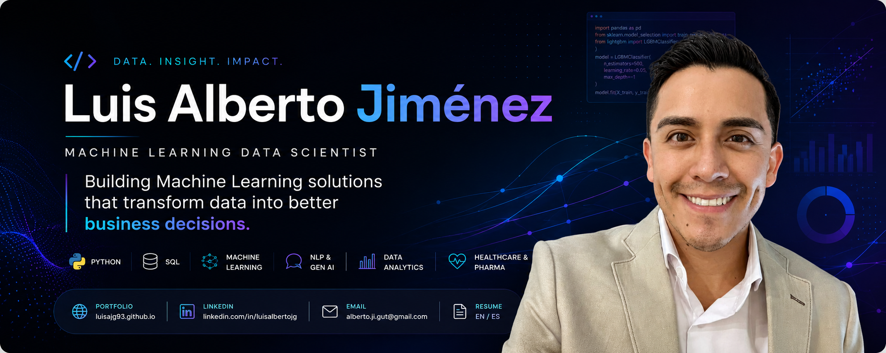

<div align="center">



</div>

<br>

# Hi, I'm Luis 👋

I build machine learning solutions grounded in business strategy.

Before transitioning into Data Science, I spent seven years helping commercial teams in the pharmaceutical industry make and execute better decisions through market analytics and healthcare insights.

Today, I combine that business experience with Python, SQL, predictive modeling, and modern AI techniques to design analytical solutions that solve real-world business problems.

I enjoy building end-to-end analytical solutions — from exploratory data analysis and feature engineering to model evaluation, visualization, and communicating actionable insights that support better business decisions.

---

## Core Strengths

<table>
<tr>
<td width="25%" valign="top">

### 🧠 Business Thinking

Translate complex data into strategic business recommendations by combining analytical rigor with commercial context and stakeholder needs.

</td>

<td width="25%" valign="top">

### 🤖 Machine Learning

Design and evaluate end-to-end machine learning solutions, from data preparation and feature engineering to model optimization and performance assessment.

</td>

<td width="25%" valign="top">

### 📈 Product Mindset

Approach analytical problems from a product perspective, focusing on measurable impact, user value, and decision support rather than model performance alone.

</td>

<td width="25%" valign="top">

### 💬 Communication

Present technical findings in a clear, business-oriented way that enables cross-functional teams to make informed decisions with confidence.

</td>

</tr>
</table>

---

## Current Focus

- Developing end-to-end Machine Learning projects
- Building AI-assisted analytical workflows
- Product Analytics & Customer Behavior Modeling
- MLOps fundamentals and model deployment
- Continuous improvement through real-world datasets

---

## Featured Projects

<table>
<tr>
<td width="33%">

### Telecom Customer Churn Prediction

Identify customers most likely to cancel their service and prioritize proactive retention strategies.

**Stack**  
Python · LightGBM · XGBoost · Scikit-Learn

**Highlights**
- ROC-AUC: **0.89**
- Accuracy: **0.84**
- Feature engineering
- Hyperparameter optimization
- Customer retention use case

[View Repository](https://github.com/luisajg93/Telecom-Customer-Churn-Prediction)

</td>
<td width="33%">

### Customer Profiling & Insurance Risk

Machine learning workflows for customer similarity, claim prediction, risk estimation, and privacy-preserving data transformation.

**Stack**  
Python · KNN · Linear Regression · Linear Algebra

**Highlights**
- Customer similarity modeling
- Insurance benefit prediction
- Regression from scratch
- Data obfuscation
- Business-oriented ML use cases

[View Repository](https://github.com/luisajg93/ml_for_customer_profiling_and_insurance_risk)

</td>
<td width="33%">

### Taxi Demand Prediction

Time series forecasting model designed to predict taxi demand and support operational planning.

**Stack**  
Python · Time Series · Regression · Scikit-Learn

**Highlights**
- RMSE: **29**
- Forecasting next-hour demand
- Lag and rolling features
- Time series analysis
- Operational decision support

[View Repository](https://github.com/luisajg93/taxi_demand_prediction)

</td>
</tr>
</table>

---

## Tech Stack

### Machine Learning
Python · Scikit-Learn · LightGBM · XGBoost · Logistic Regression · Random Forest · Model Evaluation

### Data Analysis
SQL · pandas · NumPy · SciPy · Jupyter Notebook · Exploratory Data Analysis

### AI / GenAI
NLP · Transformers · Hugging Face · Whisper · Prompt-based Workflows

### Visualization & Business Intelligence
Power BI · Matplotlib · Seaborn · Excel · Business Dashboards

### Development
Git · GitHub · Linux Basics · Reproducible Workflows

---

## My Journey

```text
Pharmaceutical Engineering
        ↓
Commercial Analytics
        ↓
Healthcare & Business Strategy
        ↓
Python + SQL
        ↓
Machine Learning
        ↓
AI / GenAI
        ↓
Building Intelligent Data Products
```

---

## Experience Highlights

<table> <tr> <td width="25%">
7+

Years translating commercial data into strategic business decisions.

</td> <td width="25%">
17+

Data Science and Machine Learning projects developed.

</td> <td width="25%">
2+

Years building Python and Machine Learning solutions.

</td> <td width="25%">
Business + ML

Bridging commercial strategy with predictive modeling.

</td> </tr> </table>

## Beyond Data Science

Beyond my technical work, I enjoy studying Tibetan Buddhist philosophy and exploring how timeless principles can improve decision-making, ethics, leadership, and long-term thinking.

I believe curiosity and continuous learning are essential to building better products, better models, and making better decisions.

## Let's Connect

<p align="center">

<a href="https://luisajg93.github.io">Portfolio</a> •
<a href="https://linkedin.com/in/luisalbertojg">LinkedIn</a> •
<a href="https://github.com/luisajg93">GitHub</a> •
<a href="mailto:alberto.ji.gut@gmail.com">Email</a>

</p>


</div> 
